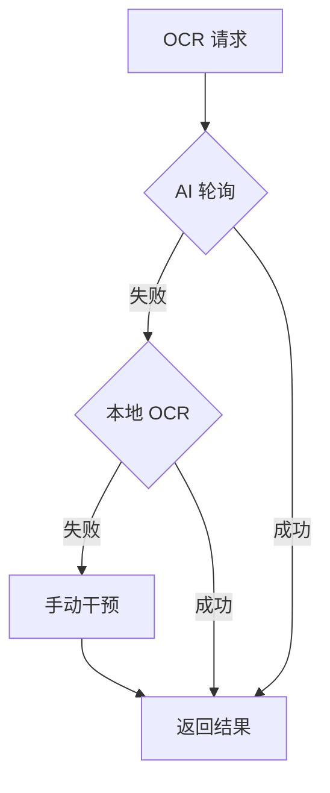

# Comprehensive Eval Pro (CEP)

CEP 是一个模块化的自动化框架，旨在处理复杂的综合评价系统任务流。它集成了账户管理、视觉识别、资源匹配和 AI 内容生成，提供了一套完整的自动化解决方案。

## 🛠️ 核心功能

- **📊 自动化审计流**: 生成结构化运行日志，确保每一步操作具备可追溯性。
- **👁️ 视觉处理 (Vision 3.0)**: 支持 AI 模型轮询与本地 OCR (ddddocr) 的自动切换降级。
- **📂 资源匹配引擎**: 基于五元组 `(School, Grade, Class, Task, Date)` 的资源自动对碰系统。
- **🧠 AI 内容生成**: 自动提取本地 Excel/Word 素材语义，驱动 AI 生成任务内容。
- **🐳 容器化支持**: 提供完整的 Docker 与 Docker Compose 部署方案。

## 📐 系统架构

## 📖 文档中心

| 文档名称 | 描述 |
| :--- | :--- |
| [快速开始](docs/quickstart.md) | 环境搭建与快速启动指南 |
| [资源管理](docs/resources.md) | 目录结构规范与匹配算法 |
| [身份管理](docs/accounts-and-tokens.md) | 账户导入与 Token 持久化 |
| [Docker 部署](docs/docker.md) | 容器化运行与挂载说明 |
| [故障排查](docs/troubleshooting.md) | 常见错误及解决方案 |

## 🚀 快速启动

1. 安装依赖：`pip install -r requirements.txt`
2. 配置凭证：编辑 `configs/settings.yaml`
3. 启动程序：`python -m comprehensive_eval_pro`

## ⚖️ 许可

本项目采用 [MIT License](LICENSE) 开源。
